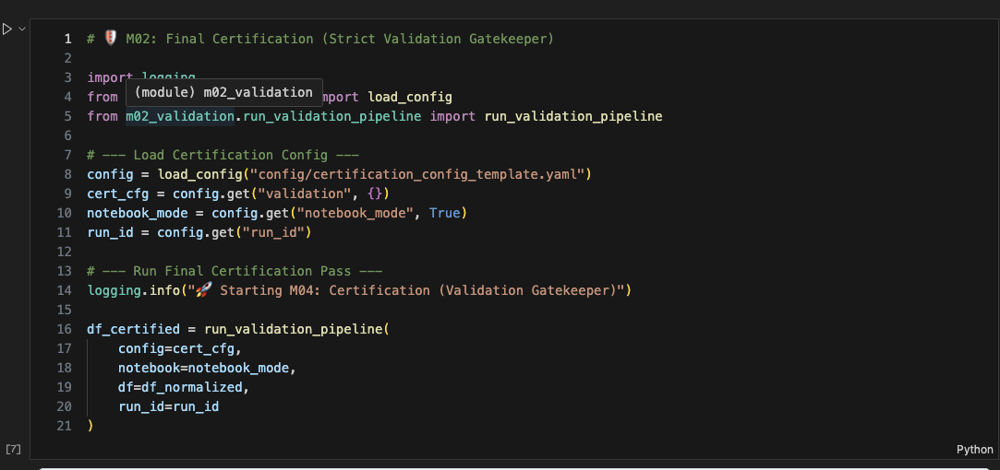
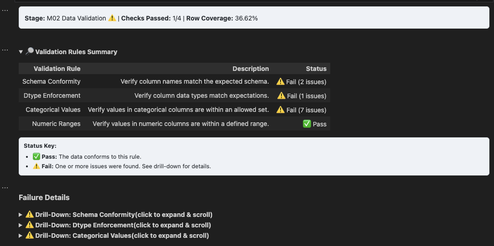
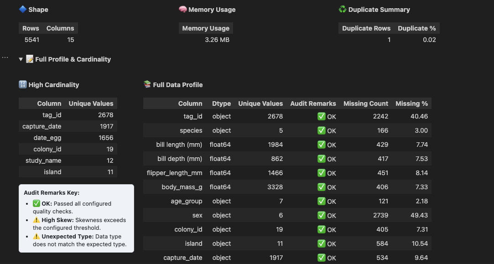
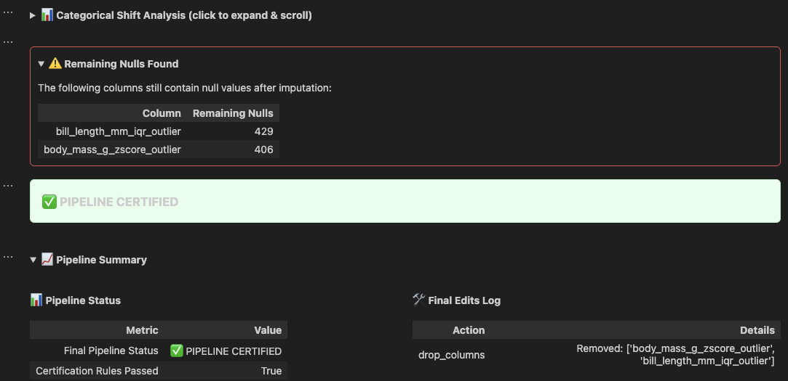

<p align="center">
  
  <br>
  <em>Self-Healing Data Audit &nbsp;·&nbsp; Data QA + Cleaning Engine &nbsp;·&nbsp; MCP Server</em>
</p>
<p align="center">
  
  
  
  <a href="https://github.com/G-Schumacher44/analyst_toolkit/actions/workflows/analyst-toolkit-mcp-ci.yml">
    
  </a>
  
</p>

# 🧪 Analyst Toolkit

Modular data QA and preprocessing toolkit — run as a Jupyter notebook pipeline, CLI, or MCP server with Docker and GCS support.

## 🆕 Version 0.4.2: The "Self-Healing" Audit

This major update transforms the toolkit from a collection of utilities into a cohesive, autonomous auditing engine.

1. **Listen (Inference):** Predict data needs automatically using `infer_configs`.
2. **Diagnose (Validation):** Detect holes (nulls) and bumps (outliers) with a single score.
3. **Heal (Auto-Apply):** Automatically repair data based on inferred rules using `auto_heal`.
4. **Certify (Audit):** Generate a tamper-proof health report and sequence ledger.

---

## 👀 MCP Ecosystem

Ship the toolkit as an MCP server and plug it into Claude Desktop, FridAI, or any JSON-RPC 2.0 client.

- **⛓️ Pipeline Mode:** Chain multiple tools in memory using `session_id` — no intermediate saves.
- **🕹️ Executive Cockpit:** Get a **0-100 Data Health Score** and a detailed **Healing Ledger**.
- **📀 Golden Templates:** Example templates tuned for typical fraud/migration/compliance patterns.
- **📚 Template Resources:** MCP `resources/list` + `resources/read` expose standard and golden YAML templates directly to clients/agents.
- **🤖 Auto-Heal:** One-click inference and repair — from raw data to certified output in a single tool call.
- [📡 MCP Server Guide](resource_hub/mcp_server_guide.md) — full setup, tool reference, and host integrations

---

## TL;DR

- Modular execution by stage (diagnostics, validation, normalization, etc.)
- Inline dashboards and exportable HTML + Excel reports
- Full pipeline execution (notebook or CLI)
- YAML-configurable logic per module
- Checkpointing and joblib persistence
- MCP server — expose all toolkit modules as tools to any MCP-compatible host
- 🐧 Built using synthetic data from the [dirty_birds_data_generator](https://github.com/G-Schumacher44/dirty_birds_data_generator)
- 📂 [Sample output](exports/sample/) (plots, reports, cleaned dataset)

---

## 📎 Resource Hub (Start Here)

- [📡 MCP Server Guide](resource_hub/mcp_server_guide.md) — Setup, tool reference, FridAI + Claude Desktop integration
- [🧭 Config Guide](resource_hub/config_guide.md) — Overview of all YAML configuration files
- [📦 Config Templates](config/) — Full set of starter YAMLs for each module (in `config/`)
- [📘 Usage Guide](resource_hub/usage_guide.md) — Running the toolkit via notebooks or CLI
- [📗 Notebook Usage Guide](resource_hub/notebook_usage_guide.md) — Full breakdown of how each module is used in notebooks
- [🤝 Contributing Guide](CONTRIBUTING.md) — Development workflow, quality gates, and PR expectations
- [📝 Changelog](CHANGELOG.md) — Versioned, deterministic release notes

---

### 📚 Quick Start Notebooks

<p align="left">
  <a href="notebooks/00_analyst_toolkit_modular_demo.ipynb" style="margin-right: 10px;">
    
  </a>
  &nbsp;&nbsp;
  <a href="notebooks/01_analyst_toolkit_pipeline_demo.ipynb">
    
  </a>
</p>

---

## 📸 Dashboard Snapshots

<div align="center">
  <table>
    <tr>
      <td></td>
      <td></td>
    </tr>
    <tr>
      <td></td>
      <td></td>
    </tr>
  </table>
</div>

<p align="center"><em>Inline dashboards rendered per-module — diagnostics, validation, outlier detection, and imputation.</em></p>

---

## 🧰 Installation

**🔧 Local Development**

```bash
git clone https://github.com/G-Schumacher44/analyst_toolkit.git
cd analyst_toolkit
make install-dev       # editable install + pre-commit hooks
```

**With MCP server deps**

```bash
pip install "analyst_toolkit[mcp] @ git+https://github.com/G-Schumacher44/analyst_toolkit.git"
```

**With notebook extras**

```bash
pip install "analyst_toolkit[notebook] @ git+https://github.com/G-Schumacher44/analyst_toolkit.git"
```

**Install from GitHub (bare)**

```bash
pip install git+https://github.com/G-Schumacher44/analyst_toolkit.git
```

---

## 🤖 MCP Server

The toolkit ships with a built-in MCP server that exposes every module as a tool callable by any MCP-compatible host — Claude Desktop, FridAI, VS Code, or any JSON-RPC 2.0 client.

**Pull from GHCR:**

```bash
docker pull ghcr.io/g-schumacher44/analyst-toolkit-mcp:latest
```

**Or build and start locally:**

```bash
make mcp-up        # docker-compose up --build -d
make mcp-health    # curl /health and pretty-print response
make mcp-logs      # tail logs
make mcp-down      # stop
# extra runtime checks:
curl http://localhost:8001/ready | python3 -m json.tool
curl http://localhost:8001/metrics | python3 -m json.tool
```

**Call a tool:**

```bash
curl -X POST http://localhost:8001/rpc \
  -H "Content-Type: application/json" \
  -d '{"jsonrpc":"2.0","id":1,"method":"tools/call","params":{"name":"outliers","arguments":{"gcs_path":"gs://my-bucket/data/"}}}'
```

Tools accept a `gcs_path` (GCS URI, local `.parquet`, or local `.csv`) and an optional `config` dict matching the module's YAML structure. HTML reports are generated automatically when `ANALYST_REPORT_BUCKET` is set, or explicitly with `export_html: true` in the config.
If template/resource reads are timing out under load, tune `ANALYST_MCP_RESOURCE_TIMEOUT_SEC` and `ANALYST_MCP_TEMPLATE_IO_TIMEOUT_SEC`.
For structured request lifecycle logs, set `ANALYST_MCP_STRUCTURED_LOGS=true`.
For token auth in networked deployments, set `ANALYST_MCP_AUTH_TOKEN` and send `Authorization: Bearer <token>`.

> See [📡 MCP Server Guide](resource_hub/mcp_server_guide.md) for full setup, tool reference, FridAI integration, Claude Desktop wiring, and environment variable reference.

---

## 🧾 Configuration

Each module is controlled by a YAML file stored in `config/`.

Example:

```yaml
validation:
  input_path: "data/raw/synthetic_penguins_v3.5.csv"
  schema_validation:
    run: true
    rules:
      expected_columns: [...]
```

For full structure and explanation, [📘 Read the Full Configuration Guide](resource_hub/config_guide.md)

---

## 🧪 Usage

<details>
<summary>📓 Notebook Use (Modular)</summary>

Run each module interactively inside a Jupyter notebook.

**Example**

```python
from analyst_toolkit.m02_validation.run_validation_pipeline import run_validation_pipeline
from analyst_toolkit.m00_utils.config_loader import load_config
from analyst_toolkit.m00_utils.load_data import load_csv

# --- Load config and data ---
config = load_config("config/validation_config_template.yaml")
df = load_csv("path/to/your/data.csv")

# --- Extract global settings ---
notebook_mode = config.get("notebook", True)
run_id = config.get("run_id", "demo_run")

# --- Run Validation Module ---
df_validated = run_validation_pipeline(
    config=config,
    df=df,
    notebook=notebook_mode,
    run_id=run_id
)
```

Modules render dashboards inline if `notebook: true` is set in the YAML config.

> See [📗 Notebook Usage Guide](resource_hub/notebook_usage_guide.md) for a full breakdown

</details>

<details>
<summary>📓 Notebook Use (Full Pipeline)</summary>

Run the full pipeline interactively inside a Jupyter notebook.

**Example**

```python
from analyst_toolkit.run_toolkit_pipeline import run_full_pipeline

final_df = run_full_pipeline(config_path="config/run_toolkit_config.yaml")
```

Each module reads its own YAML config file, with optional global overrides in `config/run_toolkit_config.yaml`. Example:

```yaml
# --- Global Run Settings ---
run_id: "CLI_2_QA"
notebook: false

# --- Pipeline Entry Point ---
pipeline_entry_path: "data/raw/synthetic_penguins_v3.5.csv"

modules:
  diagnostics:
    run: true
    config_path: "config/diag_config_template.yaml"

  validation:
    run: true
    config_path: "config/validation_config_template.yaml"
```

> See [📗 Notebook Usage Guide](resource_hub/notebook_usage_guide.md) for a full breakdown

</details>

<details>
<summary>🔁 Full Pipeline (CLI)</summary>

```bash
make pipeline                              # uses config/run_toolkit_config.yaml
make pipeline CONFIG=config/my_config.yaml # custom config
# or directly:
python -m analyst_toolkit.run_toolkit_pipeline --config config/run_toolkit_config.yaml
```

> For full structure and explanation, [📘 Read the Full Usage Guide](resource_hub/usage_guide.md)

</details>

---

<details>
<summary><strong>📝 Notes from the Dev</strong></summary>
<br>

**Why build a toolkit for analysts?**

I built the Analyst Toolkit to eliminate the most frustrating part of the analytics workflow — wasting hours on boilerplate cleaning when we should be exploring, validating, and learning. This system gives you:

- A one-stop first-pass QA and cleaning run, fully executable in a single notebook
- Total modularity — run stage by stage or all at once
- YAML-driven control over everything from null handling to audit thresholds

Every step leaves behind artifacts: dashboards, exports, warnings, checkpoints. You don't just *run* the pipeline — you *see* it working. You know what changed, where it changed, and what the implications are downstream. This is **auditable automation** — the insights are always there when you need them.

It is overbuilt in the ways that matter: transparency, reproducibility, trust. It's designed for team collaboration, for portfolio projects, for production QA. It's for your current self — and your future self — when you need to revisit a workflow six months from now.

The system is human readable and YAML-driven — for your team, your stakeholders, and yourself.

</details>

<details>
<summary><strong>🐧 Dirty Birds: Palmer Penguins Synthetic Dataset v3.5</strong></summary>
<br>

This toolkit is developed and tested using the **Dirty Birds v3.5** dataset — a fully synthetic recreation of the Palmer Penguins dataset, purposefully enriched with ambiguity, anomalies, and missing data. The dataset is generated using <a href="https://github.com/G-Schumacher44/dirty_birds_data_generator">penguin_synthetic_data_generator.py</a>, a synthetic data generator that simulates viable research data and injects realistic biological variance and field collection noise for robust QA testing.

🐧 Features include:
- Categorical anomalies (typos, whitespace, & swaps)
- Numeric outliers and skew (both in error and in biological boundaries)
- Nullable fields in both wide and narrow formats
- Simulated noise to match real-world field data collection

</details>

<details>
<summary><strong>🫆 Version Release Notes</strong></summary>

**v0.4.0 — The Cockpit Upgrade**
- **State Management:** Introduced `StateStore` for in-memory DataFrame persistence between tool calls via `session_id`.
- **Data Health Score:** Every run now generates a weighted 0-100 score (Completeness, Validity, Uniqueness, Consistency).
- **Healing Ledger:** Persistent JSON/GCS history tracking every transformation made during a run.
- **Golden Templates:** Example templates tuned for typical fraud/migration/compliance patterns (bundled in the image under `config/golden_templates/`).
- **Autonomous Tools:** Added `auto_heal` (one-click cleaning) and `drift_detection` (schema/statistical comparison).
- **Configuration Intelligence:** Added `get_config_schema` to return JSON Schemas for every module.

**v0.3.0**
- **MCP Server:** New `analyst_toolkit/mcp_server/` package exposes all toolkit modules as MCP tools over JSON-RPC 2.0 (HTTP `/rpc`) and stdio transport.
- **HTML Reports:** All modules can emit self-contained single-page HTML reports.
- **Docker / GHCR:** Image published to `ghcr.io/g-schumacher44/analyst-toolkit-mcp` on every push to main.
- **CI + Quality:** GitHub Actions: ruff lint, mypy, pytest, Docker build + GHCR push on main.

**v0.2.1**
- **Normalization · Datetime parsing:** Multi-format support, strict mode, `dayfirst`/`yearfirst`/`utc` options.
- **Exports · Excel date stability:** Explicit date formats for cross-platform rendering.
- **Duplicates · Subset-focused clusters:** Dashboard now focuses on chosen `subset_columns` for clarity.

**v0.2.0**
- **Standardized Configuration Handling:** All modules now intelligently parse their own configuration blocks.
- **Simplified Module API:** Runners accept the full config object — no manual unpacking needed.

**v0.1.3**
- Refactored Duplicates Module (M04) with correct flag/remove modes and decoupled detection logic.

**v0.1.2**
- Core module scaffolding complete (M01–M10), full pipeline execution, inline dashboards, joblib checkpointing.

</details>

<details>
<summary>📂 Project Structure</summary>

```
📦 src/                                    # Source root
│
├── analyst_toolkit/                       # 🔧 Main toolkit package
│   ├── run_toolkit_pipeline.py            # CLI + notebook entrypoint
│   │
│   ├── m00_utils/                         # Shared utilities
│   │   ├── config_loader.py               # YAML config loading and merging
│   │   ├── load_data.py                   # CSV/parquet ingestion
│   │   ├── export_utils.py                # Excel + HTML export helpers
│   │   ├── report_generator.py            # Self-contained HTML report builder
│   │   ├── scoring.py                     # Data health scoring (0-100)
│   │   ├── rendering_utils.py             # Shared display/rendering helpers
│   │   ├── data_viewer.py                 # DataFrame preview utilities
│   │   ├── plot_viewer.py                 # Inline plot display
│   │   └── plot_viewer_comparison.py      # Before/after comparison plots
│   │
│   ├── m01_diagnostics/                   # Data profiling and structural diagnostics
│   ├── m02_validation/                    # Schema validation and certification gate
│   ├── m03_normalization/                 # Data cleaning and standardization
│   ├── m04_duplicates/                    # Duplicate detection and removal
│   ├── m05_detect_outliers/               # Outlier detection (IQR, z-score)
│   ├── m06_outlier_handling/              # Outlier imputation or transformation
│   ├── m07_imputation/                    # Missing data imputation
│   ├── m08_visuals/                       # Plotting utilities and dashboard rendering
│   │   ├── comparison_plots.py            # Before/after visual comparisons
│   │   ├── distributions.py               # Distribution and histogram plots
│   │   └── summary_plots.py               # Summary/overview charts
│   │
│   ├── m10_final_audit/                   # Final audit, edits, and pipeline certification
│   │
│   └── mcp_server/                        # MCP server — exposes toolkit as tools over JSON-RPC/stdio
│       ├── server.py                      # FastAPI /rpc dispatcher + stdio transport
│       ├── io.py                          # GCS/parquet/CSV data loading + report upload
│       ├── config_models.py               # Pydantic models for typed config validation
│       ├── schemas.py                     # TypedDicts and JSON Schema for tool I/O
│       ├── registry.py                    # Tool self-registration and dispatch
│       ├── state.py                       # StateStore — in-memory session management
│       ├── templates.py                   # Golden template loader and resolver
│       └── tools/                         # Self-registering tool modules (one per toolkit module)
│
├── 🧪 notebooks/                          # Interactive tutorial notebooks (modular & full run)
│
├── ⚙️ config/                             # YAML configuration files (one per module + full run)
│   └── golden_templates/                  # Best-practice configs for Fraud, Migration, Compliance
│
├── 📂 data/
│   ├── raw/                               # Original input datasets
│   ├── processed/                         # Final certified outputs (.csv)
│   └── features/                          # Optional engineered features
│
├── 📤 exports/
│   └── sample/                            # Sample media from a QA run
│
├── tests/                                 # Pytest test suite (MCP smoke, unit tests)
├── resource_hub/                          # Reference, guidebooks, documentation
├── Makefile                               # Common dev and ops commands
├── pyproject.toml                         # Build config and optional extras
├── environment.yaml                       # Conda environment definition
├── requirements-mcp.txt                   # MCP server pip requirements
├── Dockerfile.mcp                         # MCP server container
└── docker-compose.mcp.yml                 # Docker Compose for local MCP server
```

</details>

---

## 🤝 Contributing & Support

- [Contributing Guide](CONTRIBUTING.md) — setup, branch workflow, and quality gates
- [Security Policy](SECURITY.md) — responsible vulnerability disclosure process
- [Bug Report Template](.github/ISSUE_TEMPLATE/bug_report.md)
- [Feature Request Template](.github/ISSUE_TEMPLATE/feature_request.md)
- [Documentation Template](.github/ISSUE_TEMPLATE/documentation.md)
- [Pull Request Template](.github/PULL_REQUEST_TEMPLATE.md)

---

## 🤝 On Generative AI Use

Generative AI tools (Gemini 2.5-PRO, ChatGPT 4o - 4.1, Claude Sonnet) were used throughout this project as part of an integrated workflow — supporting code generation, documentation refinement, and idea testing. These tools accelerated development, but the logic, structure, and documentation reflect intentional, human-led design. This repository reflects a collaborative process: where automation supports clarity, and iteration deepens understanding.

---

## 📦 Licensing

This project is licensed under the [MIT License](LICENSE).
